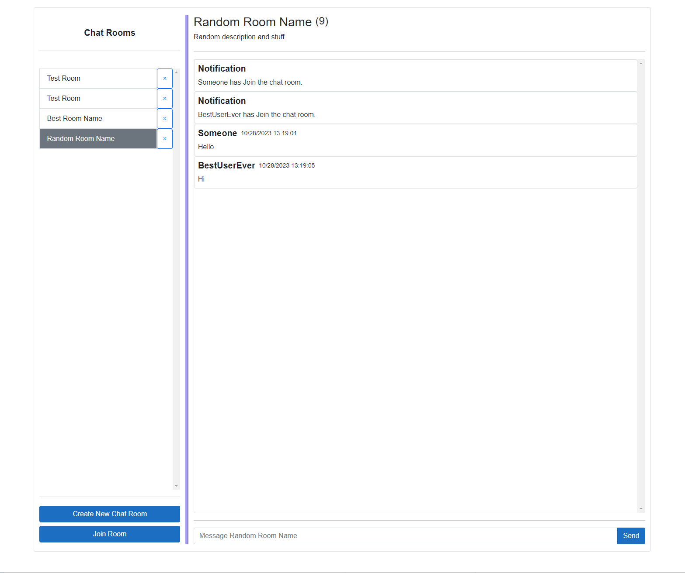

## Multi-Room Chat Application
This is an educational .NET 6 web application project for learning Blazor, SignalR, and Entity Framework. The app is able to create connections among users and send messages to users of the same chat room.

## Preview


## How to run?
1. Add Secret keys to the API Application
```
{
  "JwtSettings:Key": "SomeRandomLongJWTKey",
  "ConnectionStrings:DefaultConnection": "Server=host.docker.internal;Port=5432;Database=chatapp;User Id=root Password=root;TrustServerCertificate=True"
}
```
2. Create .env file at the root directory, filling the fields of the .env.example values.

3. Create dot net development certificates for self-signed certificates, using powershell.
```
dotnet dev-certs https --clean
dotnet dev-certs https -ep .aspnet\https\aspnetapp.pfx -p password
dotnet dev-certs https --trust
```

4. Navigate to the root directory and run the following command. You can then run the application through your docker container through the url https://localhost:5001.
```
docker compose up
```

5. To stop the containers, run the following command.
```
docker compose down
```